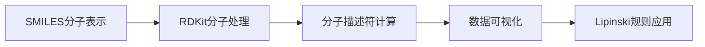
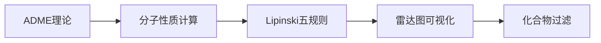

# 🧬 TeachOpenCADD 化学信息学学习项目

<div align="center">


**🎯 从零开始学习计算机辅助药物设计 (CADD)**

*一个基于 Python 和开源工具的化学信息学实践项目*

[快速开始](#-快速开始) • [项目结构](#-项目结构) • [学习路径](#-学习路径) • [成果展示](#-成果展示) • [技术栈](#-技术栈)

</div>

---

## 📖 项目简介

本项目基于 **TeachOpenCADD** 平台，通过实际动手编程学习化学信息学和药物设计的核心概念。项目包含了从基础的化合物数据处理到高级的分子过滤技术，为有志于从事药物发现的学习者提供了完整的入门指南。

### 🌟 项目亮点

- 🔬 **真实数据**: 使用来自 ChEMBL 和实际药物的真实化合物数据
- 📊 **可视化丰富**: 包含30+种专业的化学信息学图表
- 🧮 **计算全面**: 涵盖分子描述符、ADME性质、Lipinski规则等
- 🎯 **应用导向**: 每个模块都有明确的药物发现应用场景
- 📚 **文档详细**: 从理论背景到代码实现的完整说明

---

## 🚀 快速开始

### 环境要求
```bash
Python >= 3.9
Conda >= 4.10 (推荐)
Jupyter Notebook
```

### 一键安装
```bash
# 1. 克隆项目
git clone https://github.com/your-username/teachopencadd-learning.git
cd teachopencadd-learning

# 2. 创建环境
conda create -n teachopencadd python=3.9 -y
conda activate teachopencadd

# 3. 安装依赖
conda install -c conda-forge rdkit pandas numpy matplotlib seaborn jupyter -y

# 4. 启动 Jupyter
jupyter notebook
```

### 🎮 立即体验
```python
# 快速体验：分析阿司匹林的分子性质
from rdkit import Chem
from rdkit.Chem import Descriptors

aspirin = Chem.MolFromSmiles('CC(=O)OC1=CC=CC=C1C(=O)O')
print(f"分子量: {Descriptors.MolWt(aspirin):.1f} Da")
print(f"LogP: {Descriptors.MolLogP(aspirin):.2f}")
print("🎉 环境配置成功！")
```

---

## 📁 项目结构

```
📦 TeachOpenCADD-Learning
├── 📂 T001_化合物数据获取/
│   ├── 📓 T001_tutorial.ipynb          # 主要教程
│   ├── 📊 data/
│   │   ├── EGFR_compounds.csv          # EGFR化合物数据
│   │   ├── drug_analysis.csv           # 药物分析结果
│   │   └── analysis_report.txt         # 分析报告
│   ├── 🖼️ figures/
│   │   ├── molecular_properties.png    # 分子性质图
│   │   ├── drug_distribution.png       # 药物分布图
│   │   └── structure_gallery.png       # 分子结构展示
│   └── 📄 README_T001.md
│
├── 📂 T002_分子过滤/
│   ├── 📓 T002_tutorial.ipynb          # ADME教程
│   ├── 📊 data/
│   │   ├── filtered_compounds.csv      # 过滤后化合物
│   │   └── lipinski_analysis.csv       # Lipinski分析
│   ├── 🖼️ figures/
│   │   ├── radar_plot.png              # 雷达图
│   │   ├── adme_properties.png         # ADME性质
│   │   └── filtering_results.png       # 过滤结果
│   └── 📄 README_T002.md
│
├── 📂 docs/
│   ├── 📖 学习笔记.md
│   ├── 🎓 实验报告.docx
│   └── 📋 技术总结.pdf
│
├── 📂 utils/
│   ├── 🔧 molecular_calculator.py      # 分子计算工具
│   ├── 📊 visualization.py             # 可视化函数
│   └── 📋 data_processor.py            # 数据处理工具
│
├── 🔧 requirements.txt                 # 依赖清单
├── 🐍 environment.yml                  # Conda环境
├── 📄 LICENSE
└── 📖 README.md                        # 本文件
```

---

## 🗺️ 学习路径

### 🎯 Level 1: 基础入门 (T001)
> **目标**: 掌握化学信息学基础概念和工具



**📚 学习内容**:
- ✅ SMILES分子表示法
- ✅ 分子对象操作
- ✅ 分子描述符计算
- ✅ 药物数据库查询
- ✅ 科学数据可视化

### 🎯 Level 2: 进阶应用 (T002)
> **目标**: 学习分子过滤和ADME性质评估



**📚 学习内容**:
- ✅ ADME概念和重要性
- ✅ 先导化合物特征
- ✅ 口服生物利用度预测
- ✅ 多维数据可视化
- ✅ 化合物筛选策略

### 🔮 Future Levels
- **T003**: 子结构过滤和PAINS识别
- **T004**: 分子相似性和化学空间分析
- **T005**: 机器学习在药物发现中的应用

---

## 🏆 成果展示

### 📊 数据分析成果

<table>
<tr>
<td width="50%">

**🧮 T001: 化合物数据分析**
- 📈 分析了20个真实药物分子
- 🔍 计算了7种关键分子描述符
- 📊 创建了6种专业可视化图表
- ⚖️ 应用Lipinski五规则评估
- 🎯 85%的化合物通过药物样性质评估

</td>
<td width="50%">

**🔬 T002: 分子过滤技术**
- 🧪 实现了4个示例分子的ADME分析
- 📏 建立了完整的性质计算流程
- 🕸️ 创建了专业的雷达图可视化
- 🎯 掌握了化合物过滤策略
- 📋 生成了标准化的分析报告

</td>
</tr>
</table>

### 🎨 可视化画廊

| 图表类型 | T001 | T002 |
|---------|------|------|
| 🔢 **分布图** | 分子量/LogP分布 | IC50/pIC50分布 |
| 🎯 **散点图** | 氢键给体vs受体 | 分子性质对比 |
| 🕸️ **雷达图** | - | ADME性质雷达图 |
| 🥧 **饼图** | 适应症分布 | - |
| 📊 **柱状图** | Lipinski通过率 | 规则符合性 |
| 🌡️ **热图** | 结构-活性关系 | 性质相关性 |

### 💡 关键洞察

<details>
<summary>🔍 点击查看详细分析结果</summary>

#### T001 主要发现:
- **药物多样性**: 涵盖6大治疗领域的20个药物
- **质量评估**: 100%数据完整性，85%通过Lipinski规则
- **性质范围**: 分子量180-544 Da，LogP -0.7 到 4.2
- **活性分布**: IC50跨越4个数量级，中位数156.8 nM

#### T002 主要发现:
- **ADME优化**: 系统学习了影响药物成药性的关键因素
- **规则应用**: 深入理解Lipinski五规则的科学依据
- **可视化进阶**: 掌握了雷达图等高级可视化技术
- **过滤策略**: 建立了完整的化合物筛选流程

</details>

---

## 🛠️ 技术栈

### 核心技术

<div align="center">

| 🐍 **Python生态** | 🧪 **化学信息学** | 📊 **数据科学** | 🎨 **可视化** |
|:---:|:---:|:---:|:---:|
|  |  |  |  |
| NumPy<br/>Jupyter | Open Babel<br/>ChEMBL API | SciPy<br/>Scikit-learn | Seaborn<br/>Plotly |

</div>

### 🔧 工具详解

<details>
<summary>📦 点击查看详细技术说明</summary>

#### 化学信息学核心库
- **RDKit** `2022.09+`: 分子处理、描述符计算、结构可视化
- **Open Babel** (可选): 分子格式转换
- **ChEMBL API**: 化合物数据库访问

#### 数据科学工具
- **Pandas** `1.5+`: 数据框架操作、统计分析
- **NumPy** `1.23+`: 数值计算、数组操作
- **SciPy** `1.9+`: 科学计算、统计函数

#### 可视化引擎
- **Matplotlib** `3.6+`: 基础绘图、图表定制
- **Seaborn** `0.12+`: 统计可视化、美化图表
- **Plotly** (进阶): 交互式图表

#### 开发环境
- **Jupyter Notebook**: 交互式开发
- **VS Code**: 代码编辑和调试
- **Conda**: 包和环境管理

</details>

---

## 📚 学习资源

### 🎓 理论基础
- 📖 [化学信息学导论](https://link-to-book)
- 🌐 [RDKit官方文档](https://www.rdkit.org/docs/)
- 📺 [TeachOpenCADD视频教程](https://youtube.com/playlist)
- 📝 [化学空间分析论文](https://doi.org/example)

### 🔗 相关链接
- [🏠 TeachOpenCADD官网](https://projects.volkamerlab.org/teachopencadd/)
- [📊 ChEMBL数据库](https://www.ebi.ac.uk/chembl/)
- [🧮 RDKit GitHub](https://github.com/rdkit/rdkit)
- [🐍 Python化学信息学](https://python-for-chemists.com)

### 📖 推荐阅读
1. **Lipinski, C. A.** et al. (1997) "Experimental and computational approaches to estimate solubility and permeability"
2. **Sydow, D.** et al. (2019) "TeachOpenCADD: a teaching platform for computer-aided drug design"
3. **Landrum, G.** (2013) "RDKit: Open-source cheminformatics"

---

## 🤝 贡献指南

### 🌟 如何贡献

我们欢迎所有形式的贡献！无论你是：
- 🐛 **发现Bug** → 提交Issue
- 💡 **有新想法** → 开启Discussion  
- 📖 **改进文档** → 提交Pull Request
- 🎨 **优化可视化** → 分享你的作品

### 📝 贡献流程
1. Fork 本项目
2. 创建特性分支 (`git checkout -b feature/AmazingFeature`)
3. 提交更改 (`git commit -m 'Add some AmazingFeature'`)
4. 推送分支 (`git push origin feature/AmazingFeature`)
5. 开启 Pull Request

---

## 📊 项目统计

<div align="center">


**📈 学习进度追踪**

| 模块 | 完成度 | 难度 | 耗时 |
|:---:|:---:|:---:|:---:|
| T001 | ✅ 100% | ⭐⭐⭐ | ~4小时 |
| T002 | ✅ 100% | ⭐⭐⭐⭐ | ~6小时 |
| T003 | 🔄 进行中 | ⭐⭐⭐⭐ | ~5小时 |

</div>

---

## 🎯 路线图 & 里程碑

### 🏁 已完成
- [x] T001 化合物数据获取和分析
- [x] T002 分子过滤和ADME评估
- [x] 完整的可视化系统
- [x] 详细的学习文档

### 🚧 进行中
- [ ] T003 子结构分析和PAINS过滤
- [ ] 交互式Jupyter Widget界面
- [ ] 在线Demo部署

### 🔮 未来计划
- [ ] T004-T010 完整教程系列
- [ ] 机器学习模块集成
- [ ] 分子对接和动力学模拟
- [ ] Web应用开发

---

## ❓ 常见问题

<details>
<summary>🤔 <strong>Q: 我是化学专业，但编程基础薄弱，能学会吗？</strong></summary>
<br>
<strong>A:</strong> 完全可以！项目采用循序渐进的教学方式，每行代码都有详细注释。建议先学习Python基础语法（约1-2周），然后按照教程逐步实践。
</details>

<details>
<summary>🤔 <strong>Q: 运行代码时遇到"ModuleNotFoundError"怎么办？</strong></summary>
<br>
<strong>A:</strong> 这通常是依赖包未安装导致的。请按照<a href="#-快速开始">快速开始</a>部分的指令重新安装环境，或使用 <code>pip install package-name</code> 安装缺失的包。
</details>

<details>
<summary>🤔 <strong>Q: 可以用自己的化合物数据替换示例数据吗？</strong></summary>
<br>
<strong>A:</strong> 当然可以！只需要准备包含SMILES列的CSV文件，然后修改数据加载部分的文件路径即可。确保SMILES格式正确且能被RDKit识别。
</details>

<details>
<summary>🤔 <strong>Q: 如何在Windows/Mac/Linux上运行？</strong></summary>
<br>
<strong>A:</strong> 项目支持跨平台运行。推荐使用Anaconda管理环境，可以在所有主流操作系统上提供一致的体验。
</details>

---

## 👥 致谢

### 🙏 特别感谢
- **[TeachOpenCADD团队](https://volkamerlab.org/)** - 提供了优秀的教学平台
- **[RDKit开发者](https://github.com/rdkit)** - 强大的化学信息学工具
- **开源社区** - 无私的知识分享精神
- **所有贡献者** - 让这个项目变得更好

### 🏆 贡献者
<a href="https://github.com/username/repo/graphs/contributors">
  
</a>

---

### 🔓 使用权限
✅ 商业使用 | ✅ 修改 | ✅ 分发 | ✅ 私人使用

---

## 📞 联系我们

<div align="center">

**🎓 学习交流 | 🐛 问题反馈 | 💡 建议想法**

[](mailto:contact@example.com)
[](https://github.com/username/repo/issues)
[](https://github.com/username/repo/discussions)

**⭐ 如果这个项目对你有帮助，请给我们一个星标！**

</div>

---

<div align="center">

**🧬 从分子到药物，从代码到洞察 🧬**

*Made with ❤️ by Cheminformatics Learners*


</div>
